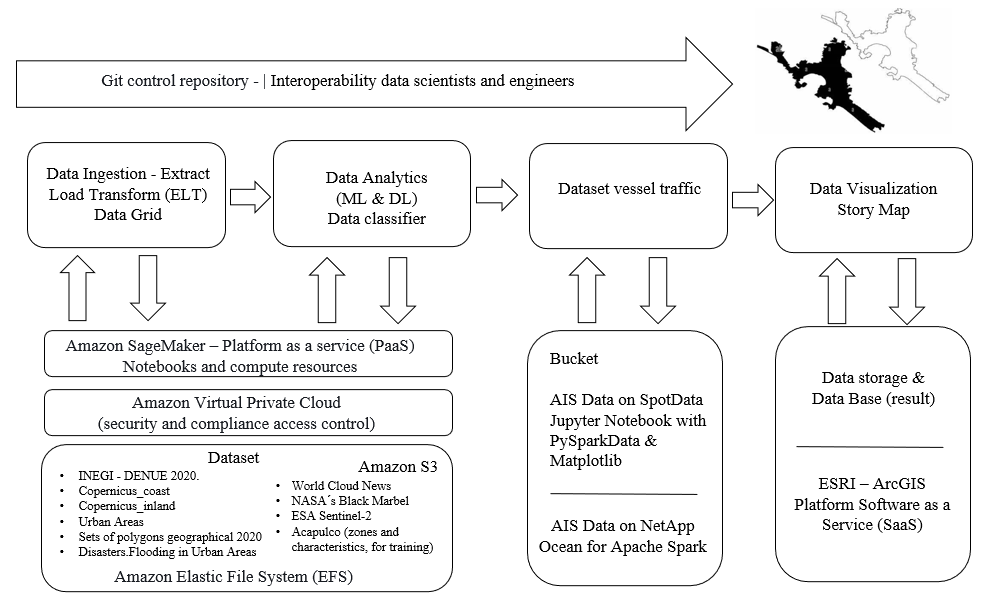

#### UN Datathon Montevideo Uruguay 2023 

Datathon participants will develop innovative data-driven applications, tools or statistical models combining geospatial data with other data sources to help advance the implementation of the Sustainable Development Goals. Research on the SDGs has converged on six transformative entry points – or key transitions – that can have catalytic and multiplier effects across the SDGs and an outsized determinant impact for achieving the Goals.

**This project focuses on the transition related to climate change.**

_Climate change: global warming is the increase in the Earth's average temperature. This rise is due to the emission of greenhouse gases into the atmosphere, which act like a blanket trapping the sun's heat. Natural greenhouse gases, such as water vapor, carbon dioxide, and methane, are essential for maintaining the Earth's habitable temperature. However, human activity has increased the concentration of these gases in the atmosphere, leading to a global temperature increase._

#### Architecture diagram

#### Goals:

- Team Develop: that addresses a global or local sustainability challenge.
- Implementation: the solution is realistic and scalable, and it has great potential to be implemented as a permanent service.-
- Innovation: the team's idea shows 'out of the box' thinking, and the team's solution is groundbreaking.
- Methods: the technology behind the idea is impressive, and the solution incorporates new methods.	
- Presentation: the project was well presented, making the idea more appealing.	
- Visualization: the data visualization is attractive, innovative, and user-friendly.	

#### Big Dataset 

- National Institute of Statistics and Geography, National Statistical Directory of Economic Units, November 2020. INEGI - DENUE 2020.
[Download (28.8 Mb)](https://drive.google.com/file/d/1NWUEatouJoNyBwJgz9IywjzAryrlcgxr/view?usp=drive_link)
- Copernicus Emergency Management Service products. Copernicus_coast 
[Download (17.5 Mb)](https://drive.google.com/file/d/1DdJmClTosIDImA0gcW_FUTbpZio69Ooq/view?usp=drive_link)
- Copernicus Emergency Management Service products. Copernicus_inland 
[Download (15.8 Mb)](https://drive.google.com/file/d/1gLN9d6xSNlgEF4ovk9lGxj1LC8-WfSIR/view?usp=drive_link)
- The International Charter Space and Major Disasters.Landslides in Urban Areas along the Acapulco Guerrero Coast, México
[Download (763 Mb)](https://drive.google.com/file/d/1h1DmeVBW4ZYCt2QQodGN4OIQPpzmKn8A/view?usp=drive_link)
- National Institute of Statistics and Geography. Sets of polygons that fully divide a geographical area with statistical information from the 2020 Population and Housing Census.
[Download (6.1 Mb)](https://drive.google.com/file/d/1dTGmM41krtcljiNviRWjzi90vSQVSf__/view?usp=drive_link)
- The International Charter Space and Major Disasters.Flooding in Urban Areas along the Acapulco Guerrero Coast, México
[Download (108.1 Mb)](https://drive.google.com/file/d/13j5CJ6Rq0QEwCdjCxQB-Gv4cP8TcqPjL/view?usp=drive_link)

____________________________________

> Web site event: https://unstats.un.org/bigdata/events/2023/un-datathon/
